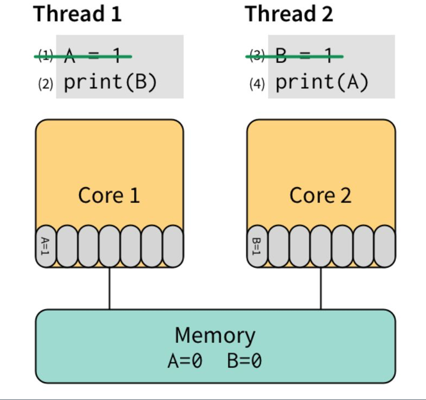

# Golang并行处理和内存模型

- Goroutine
- Memory model
- Package sync
- chan
- Package context

go语言最好用的关键字：go, chan

## Processes and Threads

- 进程：一个应用程序，一个为其所有资源(内存地址空间/设备/线程)而运行的容器。
- 线程：一个进程从一个主线程开始，然后可以依次启动更多的线程，线程共享内存空间。

## Goroutine

#### 1. Create a Goroutine
go关键字本质就是创建一个goroutine, 可以根据计算机核心来选择并行还是并发;

`main()` 就是作为 goroutine 运行的。创建goroutine的例子：

```golang
func f(){
    fmt.println(s)
}

func main(){
    s := "test"
    go f()
}
```

#### 2. 销毁Goroutine

```golang
var s string

func main(){
    go func(){s = "test"}()
    fmt.println(s)
}
```

问题点: 没有用任何同步操作限制对s的赋值，因此其他的goroutine不一定哪呢个看到s的变化，需要用锁或channel这种同步机制来建立程序的执行顺序，即" goroutine"的并行化。

#### 3. Goroutine核心要点

1. 生命周期管理：
- 知道它什么时候结束：
- 如何处理让它退出：如 http.Shutdown, context delay, chan发信号 ...
2. 把并行的行为交给调用者：如先用函数包逻辑，在main()启用goroutine

```golang
func main(){
    go func(){
        done <- serverApp()              // get exit info here
    }()
    for i := 0; i < cap(done); i++{
        <- done
        close(stop)                      // take it exit here
    }
}

func serverApp(stop chan struct{}) error{
    // goroutine1
    go func(){
        <- stop
        http.Shutdown()
    }()
    // caller goroutine2
    return http.Listen()
}
```

并行不是并发：
- 并行：多个线程同时在不同的处理器执行单元运行(1个核心)；
- 并发：为多个线程在多个核心运行。


## channel

channel通信是goroutine同步的主要方法。

每一个在特定channel的发送操作都会匹配到通常在另一个goroutine执行的接收操作。

在channel的发送操作先行发生于对应的接收操作完成:

[sync_channel.go](sync_channel.go)
```golang
var ch = make(chan int, 10)

var a string

func f(){
    a = "hello, world"
    ch <- 0
}

func main(){
    go f()
    fmt.Println(a)
}
```
保证"hello world"的成功print


## Lock 锁

https://golang.org/pkg/sync/

golang的sync实现了两个锁的数据类型:
- sync.Mutex
- sync.RWMutex


Example: goroutine场景中，使每n次调用f()先行发生于第n+1次调用f()

[sync_mutex.go](sync_mutex.go)
```golang
var l sync.Mutex
var s string
场景：cfg为包机全局对象，当很多goroutine同时访问时，存在data race，会看到不连续的内存输出。

用go同步语义解决：
- Mutex 互斥锁
- RWMutex 读写锁
- Atomic 原子锁


func f() {
    s = "hello world"
    l.Unlock()
}

func main() {
    l.Lock()
    go f()
    l.Lock()
    fmt.Println(s)
}
```


## Memory model

Must read reference:
- https://golang.org/ref/mem
- https://www.jianshu.com/p/5e44168f47a3

阐述问题核心：`Happen-Before 先行发生` 多个Goroutine谁先谁后的问题， Example:

```python
# 以下两段代码，运行中若插入一个线程 x = 0
# 代码源码， 输出为： 11111011111 ..
x = 0
for i in range(100):
    x = 1
    print(x)

# 从硬件设计看，编译器优化重排会导致幺蛾子：
x = 1
for i in range(100):
    print(x)
# 输出则可能为 11111100000 ..
```



1. e1,e2两个事件同时发生，没有前后，我们认为这是并发行为
2. 两个线程因为内存重排，由cache读取而不是到RAM，导致先行读到0输出。

解决问题方案：`memory barrier` 内存屏障：即"锁"支持：

要求所有对RAM的操作必须“扩散”到memory之后才能继续执行其他对memory的操作，我们可以用
锁/原子/channel 或 更高级的锁 来处理(golang标准库可提供)。

核心概念：

`memory barrier` 表现为对一个变量v， `"w -> r"` 先写后读这个动作过程不受其他操作干扰：

1. 读操作`r`看到最近一次的写操作`w`写入`v`的值
2. 多个Goroutine共享`v`时，必须使用同步时间来建立`Happen-Before`


做实验：
go race command: `go build -race xx.go`
Assembly processes: `go tool compile -S xx.go`

## package sync

场景：cfg为包机全局对象，当很多goroutine同时访问时，存在data race，会看到不连续的内存输出。

用go同步语义解决：
- Mutex 互斥锁
- RWMutex 读写锁
- Atomic 原子锁
